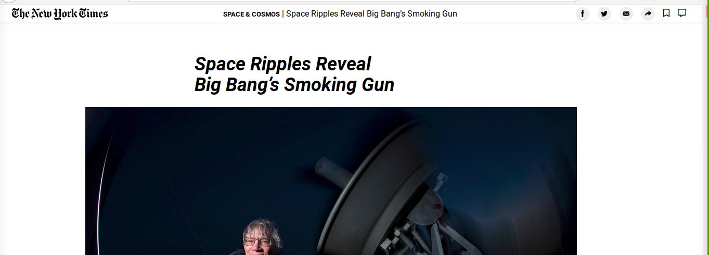
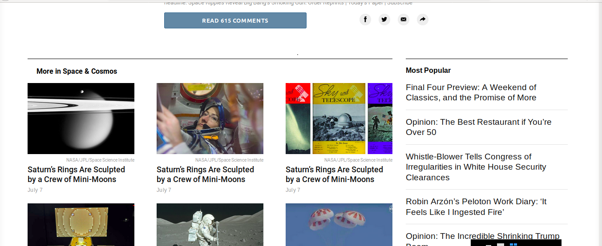

# Project: HTML & CSS3: Positioning and Floating Elements ([NYT clone](https://www.nytimes.com/2014/03/18/science/space/detection-of-waves-in-space-buttresses-landmark-theory-of-big-bang.html?_r=0))

This is the third project of the Main HTML/CSS curriculum at [Microverse](https://www.microverse.org/) - @microverseinc
* The goal is to learn about CSS3 Positioning and Floating Elements by recreating a NYT page 
* The project was completed using html and css 

#### [Assignment link](https://www.theodinproject.com/courses/html5-and-css3/lessons/positioning-and-floating-elements)

#### [View in broswer](https://torreschief.github.io/nyt-clone)

#### Live ScreenShot of the page

#### Authors

* [@TorresChief](https://github.com/TorresChief)
* [@bolah2009](https://github.com/bolah2009/)